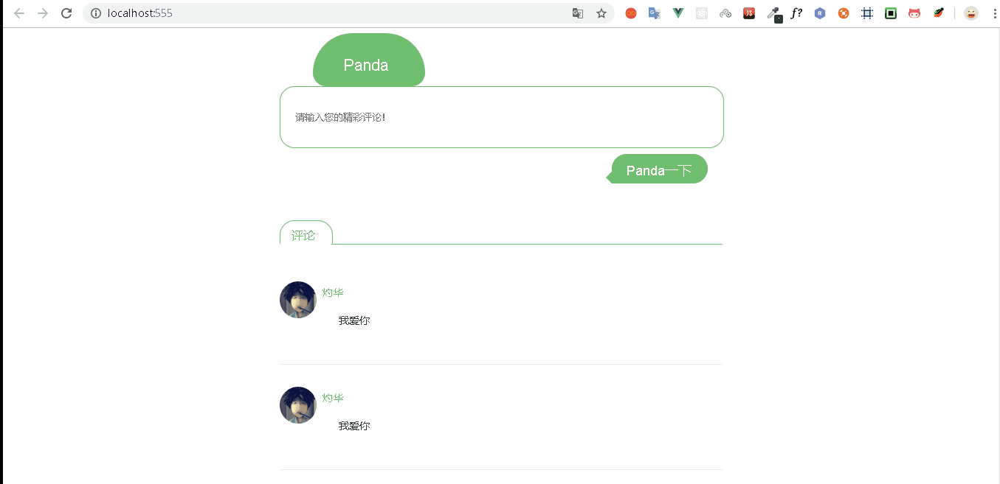

# PandaCommentComponent

### Introduction

>This is a Vue-based comment component, you are free to make a second transformation on it, become your stuff, and finally apply it to real projects. I call it the Panda Comment component.

### How To Use？
 
```bash
npm i pandacomment
```

#### InTheTemplate

```javascript
import {PandaComment} from 'pandacomment'

//In vue template

export default {
    components: {
        PandaComment
      }
}

```

```vue
<div>
<PandaComment/>
</div>
```
### 效果演示




### LICENSE

Copyright (c) 2018 Eric Wang
